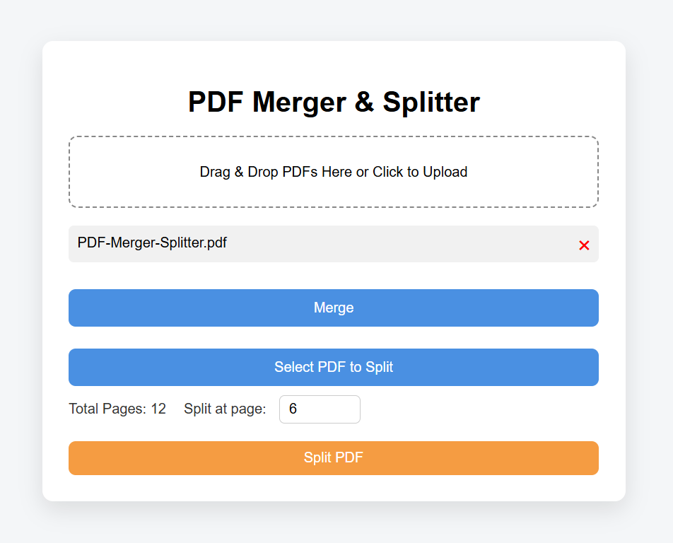
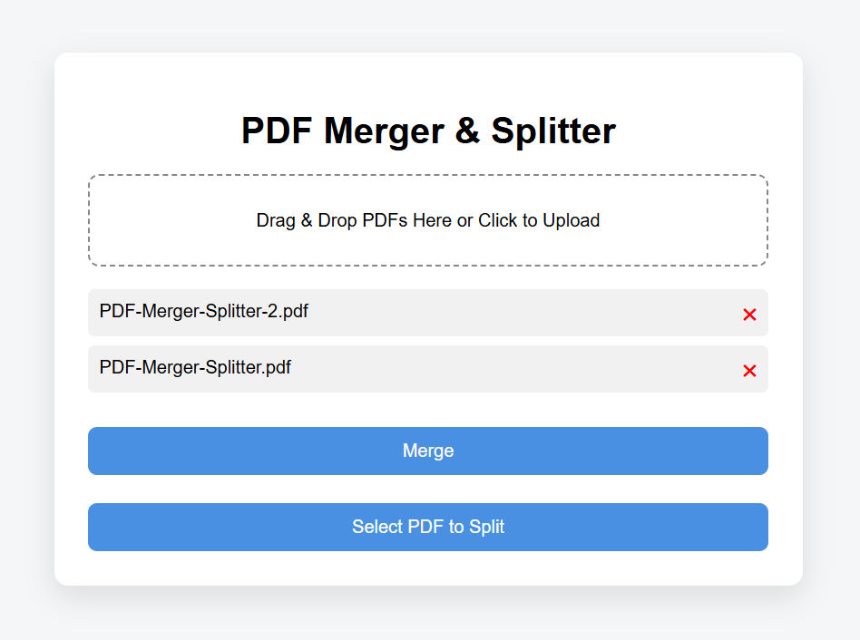

# PDF Merger & Splitter

A lightweight, browser-based PDF utility that allows users to merge and split PDF files directly in their browser — with no uploads, no paywalls, and no file size limits beyond browser memory.

🔗 **Live Demo:**  
https://patzerzach.github.io/PDF-Merger-Splitter

---

## Purpose

Many online PDF tools:

- Require file uploads to external servers
- Impose file size limits
- Lock features behind paywalls
- Raise privacy concerns

I built this project to provide a simple, privacy-first alternative that runs entirely in the browser.

There is:

- No backend
- No server
- No file uploads
- No tracking
- No artificial limits

Just a clean, functional PDF utility without paywalls.

---

## Features

- Drag-and-drop PDF uploads
- Click-to-upload support (Windows, macOS, Linux)
- Upload multiple PDFs at once
- Drag-to-reorder before merging
- Merge multiple PDFs into one
- Split a PDF at any chosen page
- Fully client-side processing

---

## Running Locally

There are two main ways to run this project locally:

---

### Option 1: Clone the repository

```bash
git clone https://github.com/PatzerZach/PDF-Merger-Splitter.git
cd PDF-Merger-Splitter
```

---

### Option 2: Download as ZIP

1. Click the green **Code** button on the repository page or select the latest release ZIP [here](https://github.com/PatzerZach/PDF-Merger-Splitter/releases/tag/v1.0.0).
2. Select **Download ZIP**.
3. Extract the downloaded file.
4. Open the extracted `PDF_Merger-Splitter` folder.
5. Double click `index.html` to launch the application in your preferred web browser.

---

## How It Works

This application runs entirely in the browser using:

- Vanilla JavaScript
- pdf-lib (for PDF manipulation)
- SortableJS (for drag-and-drop ordering)

### Processing Flow

1. Files are loaded as `File` objects in browser memory.
2. PDFs are read using `arrayBuffer()`.
3. pdf-lib handles merging or splitting.
4. A new PDF is generated in memory.
5. The browser triggers a download via a Blob URL.

No files are ever uploaded or transmitted.

All processing happens locally on the user’s machine.

---

## 📷 Screenshots

### Upload & Merge Interface

  

---

### Split Functionality



---

### Drag-to-Reorder



---

## Privacy & Security

- No backend server
- No file uploads
- No analytics
- No cookies
- No localStorage usage

Because this is a static site and also hosted on GitHub Pages, it cannot receive or store user files.

---

## Development Approach

This project was developed with AI-assisted tooling (ChatGPT).

AI was leveraged to:

- Accelerate UI iteration
- Refactor and debug logic
- Consider UX improvements
- Improve code clarity

All architectural and implementation decisions were reviewed and understood before finalizing the project.

Modern software development increasingly incorporates AI-assisted workflows, and this project reflects practical experience using those tools effectively.
